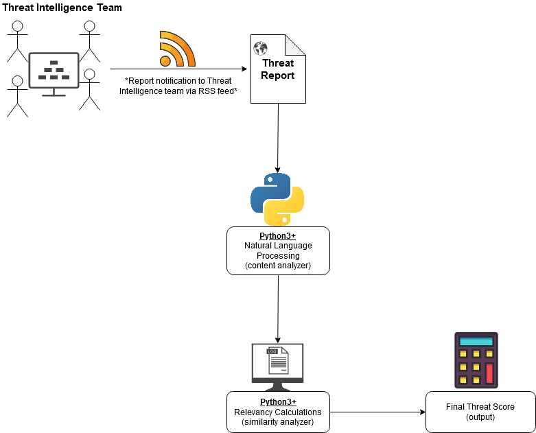

University of Dayton

Department of Computer Science

CPS 490 - Fall 2020

Dr. Phu Phung

## Capstone II Proposal

# Cyber Threat Reports

# Team members

1. Beth Hosek, hoseke1@udayton.edu
2. Dena Schaeffer, backd1@udayton.edu
3. Jacob Scheetz, scheetzj2@udayton.edu
4. Justen Stall, stallj2@udayton.edu

# Company Mentors

Jeffrey Archer, Senior Staff Cybersecurity Researcher

GE Aviation

Cincinnati, OH

## Project Management Information

Link to repository: <https://bitbucket.org/cps491s21-team8/cps491s21-team8.bitbucket.io/src/master/>

Link to Trello: <https://trello.com/b/LNj1LyZ5/ge-project>

Project Homepage (Public):<https://cps491s21-team8.bitbucket.io/>

## Overview

The goal is to develop a classification system that can analyze the text of a threat intelligence report and produce a score which quantifies the relevancy of that report to the receiving organization based on a list of user-defined relevant topics.

Figure 1. - A Sample of Overview Architecture of the proposed project.

# Project Context and Scope

This project will be used by GE Aviation's Cyber Intelligence team to provide a priority to their research of open-source intelligence(OSINT) reports. As a global company doing high-value work, the volume of relevant reports published daily is too much for even a large team of analysts to read and understand quickly. Our tool would help give priority to what reports need to be read first and what can be overlooked, making sure each piece of vital information gets the attention it needs.

# High-level Requirements

- A natural language processor/content analyser to analyze the contents of threat reports and pick out key terms and themes
- Similarity analyzer to compare the output of the content to a user
- Significance/relevance score calculator that generates a numerical representation of the output of the similarity analyzer to indicate how relevant a report is to the user-defined list of topics.

# Use Cases

Figure 2. - Overview Use Case Diagram

# Technology

- Python3.8 (relevancy calculator, natural language processing)
- Bash scripting (outputting data, output formatting)
- RSS feeds (data collected via RSS feeds)

# Company Support

Our company mentor, Jeffrey Archer, has already provided us with the files and technology requirements we need for this project. He also has provided us with an open source for communication whenever necessary, and a plan to meet at least once per release cycle.

# Software Process Management

We will follow the Scrum approach, using the following timeline. We have initial tasks for Sprint 0 and Sprint 1 so that we can get started next semester.

Figure 3. - Trello board timeline with sprit cycles and tasks

## Scrum process

### Sprint 0

Duration: 1/19/2021-1/26/2021

#### Completed Tasks:

1. Create a “sprint0” branch in your team's main repository (use the existing one from Capstone I or create a new repository. Ensure that you share your team workspace with cps490f20@gmail.com)
2. Extend the proposal to make it the main report, add
   - Overview use case diagram
   - Use case descriptions
   - The initial design of the database (if applicable)
3. Revise the Trello board to modify the sprints, backlogs, if needed
   - Put the deadlines according to the revised course schedule
4. Tool/software installation
5. Update your team homepage with useful information, e.g., course info, your team, project title and overview, and sponsored company

#### Contributions:

1. Justen Stall, 3 commits, 3 hours, contributed in tasks 2, 4, and 5
2. Dena Schaeffer, 3 commits, 3 hours, contributed in 1, 2, 3, and 4
3. Member 3, x commits, y hours, contributed in xxx
4. Member 4, x commits, y hours, contributed in xxx
